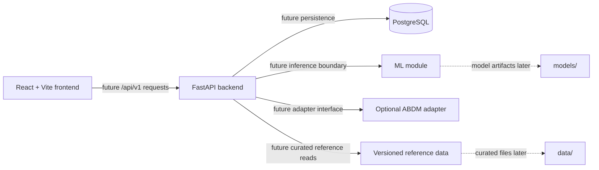

# MediPlan AI — Architecture (Phase 4)

## 1. Scope and Principles

This is the technical foundation for the Type 2 Diabetes, synthetic-data, clinician-reviewed prototype defined in [project-scope.md](project-scope.md), [requirements.md](requirements.md), and [ux-design.md](ux-design.md). It intentionally contains no patient APIs, persistence models, database migrations, ML models, business rules, authentication implementation, or ABDM integration.

The core workflow remains patient context → validation → AI-assisted risk result → explanation → controlled treatment-support reference → affordability and facility context → clinician review → audit. The system must never autonomously diagnose or prescribe.

## 2. System Architecture

Only PostgreSQL is containerised in this phase. The frontend and backend remain local-development processes to minimise friction while the application is still being built.

## 3. Repository Boundaries

| Location | Responsibility | Phase 4 status |
| --- | --- | --- |
| `frontend/` | React/Vite client; future UX screens, services and hooks | Vite foundation only; empty application shell |
| `backend/app/api/` | Future versioned API routers | Package placeholder only |
| `backend/app/models/` | Future persistence models | Package placeholder only |
| `backend/app/schemas/` | Future request/response contracts | Package placeholder only |
| `backend/app/services/` | Future business/application services | Package placeholder only |
| `backend/app/ml/` | Future model loading/inference boundary | Package placeholder only |
| `backend/app/integrations/abdm/` | Optional future ABDM adapter | Isolated placeholder only |
| `data/raw/` | Source datasets kept with provenance as permitted | Empty tracked directory |
| `data/processed/` | Reproducibly generated derived data | Empty tracked directory |
| `data/medicines/` | Curated source-dated medicine references | Empty tracked directory |
| `data/facilities/` | Curated facility/service references | Empty tracked directory |
| `models/` | Versioned model artifacts only when later approved | Empty tracked directory |
| `scripts/` | Reproducible operational/data scripts later | Empty tracked directory |
| `infrastructure/` | Future infrastructure configuration | Empty tracked directory |

`data/` and `models/` are deliberately not ignored. Only valid, reviewed artifacts should be committed; raw licensed datasets, secrets, and large/generated files need an explicit later data-governance decision.

## 4. Frontend and Backend Relationship

The React client will implement the clinician UX defined in [ux-design.md](ux-design.md). It will call the FastAPI service through a configurable `VITE_API_BASE_URL`; no URL is hard-coded into components. Backend response contracts will be introduced with schemas before UI integration. The frontend must render source dates, unavailable/unknown states, safety wording, and model limitations rather than infer them.

## 5. API Conventions

- Future domain endpoints use `/api/v1/` and plural resource names (for example, `/api/v1/patients`).
- JSON is the default request and response format; schemas will define contracts before endpoint implementation.
- Validation failures use a consistent JSON error envelope in a later API phase; no domain error contract is implemented yet.
- `/health` is the sole Phase 4 endpoint. It is a dependency-free local liveness check, not a patient, authentication, or clinical API.
- Patient identifiers, secrets and unnecessary health payloads must not be included in logs or error messages.

## 6. ML Boundary

`backend/app/ml/` will isolate future preprocessing, model version lookup, inference, model metadata, and explanation orchestration from HTTP routing and clinician decision workflow. The Phase 2 candidate output is an early-readmission probability for a diabetes-coded encounter, not a prescription or diagnosis. Phase 7 must validate the Type 2 cohort/data dictionary and leakage controls before any model is trained or loaded.

## 7. ABDM Boundary

`backend/app/integrations/abdm/` is intentionally separate from core services. A future adapter may implement authorised sandbox interaction, consent-aware flows and compatible data exchange. In its absence or failure, the core synthetic/manual workflow must continue. No credentials, tokens, client, HTTP call, or ABDM workflow is present now.

## 8. Data Flow

1. A future clinician UI collects or selects a synthetic patient record.
2. A future API validates structured data and returns actionable field errors.
3. A later ML service receives only validated, approved feature inputs and returns a versioned risk result plus data-quality/explanation metadata.
4. Later services present controlled treatment-support references, medicine provenance, and facility-specific availability without prescribing or automatic referral.
5. A later clinician-review action creates an attributable audit record.

No data flow in Phase 4 processes patient data, calls external systems, or writes to PostgreSQL.

## 9. Environment Configuration

Copy `.env.example` to `.env` for local development and set a local `POSTGRES_PASSWORD`. `.env` and `.env.*` are ignored; `.env.example` is explicitly trackable. Expected variables are:

| Variable | Purpose |
| --- | --- |
| `POSTGRES_DB` | Local database name |
| `POSTGRES_USER` | Local database user |
| `POSTGRES_PASSWORD` | Local-only database password; never commit |
| `POSTGRES_PORT` | Host port mapped to PostgreSQL |
| `BACKEND_PORT` | Reserved local FastAPI port |
| `VITE_API_BASE_URL` | Future frontend API base URL |

## 10. Docker Architecture

`docker-compose.yml` defines a single development PostgreSQL 16 service with a named `postgres_data` volume and readiness health check. It intentionally does not define frontend or backend containers, Dockerfiles, application networking, production settings, or secret management beyond Compose variable substitution. Those decisions belong to later implementation/deployment work.
