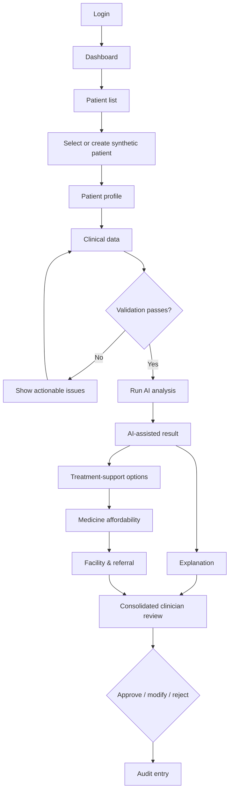

# MediPlan AI — Product & UX Design (Phase 3)

## 1. Product Overview

| Item | Decision |
| --- | --- |
| Product | MediPlan AI |
| Primary user | Clinician |
| MVP disease | Type 2 Diabetes |
| Product type | AI-assisted clinical decision-support platform |
| Core principle | The system assists clinician judgement; it does not autonomously diagnose, prescribe, order medicines, or replace a clinician. |
| Demonstration boundary | Synthetic/test patients only. |

The future model view is a conditional, discharge-time estimate of <30-day readmission risk for a diabetes-coded encounter. It is not a diagnosis, treatment-response, drug-selection, or prescribing output. The Type 2 cohort limitation and source-data caveats must remain visible where results are shown. See [research.md](research.md#4-ml-task-and-target-research).

### Primary persona: clinician

The clinician needs a short, patient-centred path from structured information to a reviewable decision record. Their immediate needs are to identify a synthetic patient, see whether clinical inputs are ready, interpret the AI-assisted result and its limitations, compare verified reference information, resolve service constraints, and record a human decision. Patient-facing journeys are out of scope.

## 2. Information Architecture

```text
MediPlan AI
├── Login
├── Dashboard
├── Patients
│   ├── Patient list
│   ├── Create synthetic patient
│   └── Patient profile
│       ├── Overview
│       ├── Clinical data
│       ├── AI analysis
│       └── Audit history
├── AI Analysis
│   ├── Validation
│   ├── Run analysis
│   ├── Results
│   └── Explanation
├── Treatment support
├── Medicines
├── Facilities & referral
├── Clinician review
└── Audit
```

Patient Profile is the workflow hub. AI analysis, treatment support, medicine comparison, facility/referral and clinician review always retain patient context; they are not disconnected global tools. The separate audit area provides cross-patient history while the profile exposes that patient's history.

## 3. Navigation

- **Desktop/laptop:** persistent left sidebar: Dashboard, Patients, Audit. Patient-specific workflow navigation appears only after a patient is selected: Overview, Clinical Data, Analysis, Treatment Support, Medicines, Facilities & Referral, Review, Audit History.
- **Top bar:** product name, current synthetic-patient reference when selected, a compact prototype badge, and account menu. No patient identifiers are displayed in the global navigation.
- **Breadcrumbs:** use on patient-specific pages: `Patients / [Synthetic reference] / [Current step]`.
- **Back behaviour:** preserve unsaved-form warning and return to the prior workflow step; the sidebar can move deliberately between sections.
- **Current-page indication:** highlighted sidebar item plus visible page title. A linear workflow stepper appears from Clinical Data through Review; it reflects status but does not hide pages.

## 4. Primary User Journey



The result, explanation, treatment-support, medicine, and facility views can be reviewed in any order after analysis. Clinician Review remains blocked until the analysis and all required review sections have either been viewed or explicitly marked unavailable/unknown.

## 5. Screen Inventory

| ID | Screen | Purpose | Primary action |
| --- | --- | --- | --- |
| UX-01 | Login | Clinician access entry point | Log in |
| UX-02 | Dashboard | Resume patient-centred work | Select patient |
| UX-03 | Patient List | Find or start a synthetic record | Search, select, create |
| UX-04 | Create Patient | Create a synthetic demo patient | Save synthetic patient |
| UX-05 | Patient Profile | Understand patient context | Review / open workflow step |
| UX-06 | Clinical Data | Enter/review records and measurements | Save and validate |
| UX-07 | Validation | Resolve data readiness issues | Fix issues / continue |
| UX-08 | AI Analysis | Confirm and initiate analysis | Run analysis |
| UX-09 | AI Results | Present model output and limitations | Continue to review |
| UX-10 | Explanation | Explain feature associations | Inspect details |
| UX-11 | Treatment Support | Show controlled review options | Mark reviewed |
| UX-12 | Medicines | Compare verified affordability references | Compare / mark reviewed |
| UX-13 | Facility/Referral | Check service status and candidate referral | Evaluate / mark reviewed |
| UX-14 | Clinician Review | Record the human decision | Approve, modify, reject |
| UX-15 | Audit | Inspect attributable history | Inspect record |

No screens are combined because the validation, AI-result, affordability, facility, and clinician-decision boundaries are safety-significant. They share patient context and workflow navigation to avoid fragmentation.

## 6. Screen Requirements and Interactions

### UX-01 — Login

Email or username, password, and a single Log in action. Show a generic invalid-credentials message; never reveal whether an account exists. Disable the submit action while authentication is in progress. Authentication is a later implementation and no credentials are designed or stored in this phase.

### UX-02 — Dashboard

Show Recent patients, Recent analyses, Pending clinician reviews, Patient search, Create synthetic patient, and concise system-status notices. Do not add generic KPI charts. A pending review item opens the relevant patient’s Review page; a result labelled unavailable routes to its error state.

### UX-03/04 — Patient List and Create Patient

The list supports reference/age/sex/current-facility/review-status/last-analysis search or filtering, with synthetic patient reference as the leading identifier. Creation captures only: external synthetic reference, age, sex, height, weight, and current facility. A persistent banner says “Synthetic/test record — not for real patient use.” Required-field markers are visual, and unvalidated clinical details belong in Clinical Data rather than the creation form.

### UX-05/06 — Patient Profile and Clinical Data

Profile groups Basic Information, Clinical History, Allergies, Current Medications, Previous Treatments, Laboratory Results, Previous AI Analyses, and Review Status. Clinical Data uses clear Required / Optional labels and a reviewable record list. Each measurement has value, unit, collection date, and reference/source where relevant. Missing values, invalid unit/type, and consistency warnings are inline and summarised at the top. No clinical ranges are displayed until clinician validation establishes them.

### UX-07/08 — Validation and AI Analysis

Validation gives each issue a severity, plain reason, affected field, and **Fix issue** link. Blocking issues prevent analysis; optional-missing warnings may be acknowledged. The Analysis page shows patient reference, validated-input summary, data-completeness state, task (“<30-day readmission-risk estimate”), model-version placeholder, and the persistent safety message. Running analysis uses an in-page progress state; it does not promise a clinical conclusion.

### UX-09/10 — AI Results and Explanation

Results lead with **AI-assisted decision-support result — clinician review required**. Present the probability, model version, timestamp, input-quality warnings, selected-dataset limitation, and links to explanation and the downstream review sections. Avoid “high risk” unless a future clinician-approved threshold exists; until then use “review flag” and probability. Explanation lists feature contribution direction/magnitude when available, a plain-language summary, and: “These factors show associations learned by the model and are not causal medical conclusions.”

### UX-11 — Treatment Support

Show controlled **treatment-support options** separately from model output. Each card contains option name, supporting/reference information, relevant limitation, optional affordability link, and “Mark reviewed.” Never label an option “prescription,” “AI prescribed,” or “automatically selected medicine.”

### UX-12 — Medicines

Use a comparison table: Generic, Brand, Strength, Form, Pack, Price (INR), Source, Last verified, Jan Aushadhi status, and comparable savings. Only show savings for like-for-like strength/form/pack. The page banner says “Reference MRP only; not stock availability, therapeutic interchangeability, or prescribing advice.”

### UX-13 — Facility & Referral

Show current facility, required service/test, availability (`Available`, `Unavailable`, `Unknown`), source, last verified date, and candidate facility/level if relevant. `Unknown` is visually distinct from `Unavailable`. The referral wording is “Candidate referral for clinician review,” with a reason tied only to service-status information. No facility-level default capability is hard-coded.

### UX-14 — Clinician Review

One vertically ordered, printable review summary: Patient Summary → Clinical Data Summary → AI Result and Limitations → Explanation → Treatment Support → Medicines → Facility/Referral → Clinician Decision. Actions:

- **Approve:** require confirmation that the clinician reviewed AI limitations.
- **Modify:** require an editable clinician modification note and optional rationale.
- **Reject:** require a reason; return to a selected workflow section if remediation is needed.

The action is the clinician’s review of decision-support material, not an order or prescription.

### UX-15 — Audit

List patient synthetic reference, analysis/review timestamps, actor, action, model version, concise output status, and source/reference snapshots. Default to minimal necessary information; audit detail avoids secrets and unnecessary clinical payloads.

## 7. Low-Fidelity Wireframes

### UX-01 Login

```text
+--------------------------------------------------+
| MediPlan AI                         Prototype    |
| AI-assisted decision support; clinician review.  |
|                                                  |
| Email or username [________________________]     |
| Password          [________________________]     |
|                                                  |
| [ Log in ]             Invalid credentials: —    |
+--------------------------------------------------+
```

### UX-02 Dashboard

```text
+Sidebar------+-----------------------------------------------+
| Dashboard   | Dashboard                         [Search]      |
| Patients    | [Create synthetic patient]                      |
| Audit       | Pending reviews                                 |
|             | • SYN-204 · review due       [Open review]     |
|             | Recent patients               Recent analyses   |
|             | SYN-204 [Open]                SYN-108 [Open]   |
+-------------+-----------------------------------------------+
```

### UX-03 Patient List

```text
Patients                                  [Create synthetic patient]
[Search reference / facility] [Review status v]
-----------------------------------------------------------------
Reference | Age | Sex | Current facility | Last analysis | Status
SYN-204   | 54  | F   | Example PHC      | 17 Aug        | Pending [Open]
```

### UX-04 Create Patient

```text
Create synthetic patient     [Synthetic/test record — demo only]
Reference* [SYN-____]   Age* [__]   Sex* [v]
Height    [____]        Weight [____]  Current facility* [v]
[Cancel] [Save synthetic patient]
```

### UX-05 Patient Profile

```text
Patients / SYN-204 / Overview             [Start/reopen analysis]
Basic information | Current facility | Review status
Clinical history  | Allergies        | Current medications
Previous treatments | Laboratory results | Previous AI analyses
[Edit clinical data] [View audit history]
```

### UX-06 Clinical Data

```text
SYN-204  > Clinical Data        Step 1 of 5
[History] [Allergies] [Medications] [Laboratory results]
Required fields: 12/14 complete     Warnings: 1
Measurement | Value | Unit | Collection date | Status
[Add record] [Save] [Validate clinical data]
```

### UX-07 Validation

```text
Clinical Data Check
✓ Required demographic data complete
⚠ 1 optional item missing                 [Review]
✕ Unit needs correction: [Affected field] [Fix issue]
Analysis cannot run until blocking issues are fixed.
[Back to clinical data]                    [Continue to analysis]
```

### UX-08 AI Analysis

```text
Run AI Analysis — SYN-204
Task: <30-day readmission-risk estimate
Validation: Ready     Data quality: 1 non-blocking warning
Model: Version shown after release
AI-assisted decision support only; clinician review required.
[Back]                                     [Run analysis]
```

### UX-09 AI Results

```text
AI-assisted decision-support result — clinician review required
Probability: [future model value]     Model version: [version]
Analysed: [timestamp]                 Data warning: [if any]
Not a diagnosis, prescription, or treatment-response prediction.
[Why this result?] [Treatment support] [Continue to review]
```

### UX-10 Explanation

```text
Why this result?                         [Back to result]
Feature contribution view [future visualisation]
1. [Feature]  [direction/magnitude]   2. [Feature] [direction/magnitude]
These are model associations, not causal medical conclusions.
[View detailed explanation] [Treatment support]
```

### UX-11 Treatment Support

```text
Treatment-support options — for clinician review
[Option name]  Supporting reference / limitation  [Affordability] [Mark reviewed]
[Option name]  Supporting reference / limitation  [Affordability] [Mark reviewed]
No option is a prescription or automatically selected medicine.
[Medicines] [Facilities & referral] [Review]
```

### UX-12 Medicine Affordability

```text
Medicine affordability — verified reference comparison
Generic | Brand | Strength/form/pack | INR | Source | Verified | Status
...     | ...   | ...                | ... | ...    | ...      | Jan Aushadhi
Reference MRP only; not availability or clinical preference.
[Back] [Mark reviewed] [Facilities & referral]
```

### UX-13 Facility & Referral

```text
Facility & referral
Current facility: Example PHC      Required service: [Service]
Availability: [Available / Unavailable / Unknown]   Source/date: [...]
Candidate referral: [facility / level]  Reason: service status
Candidate referral for clinician review; not an automatic referral.
[Mark reviewed] [Go to clinician review]
```

### UX-14 Clinician Review

```text
Clinician Review — SYN-204
[Patient summary] [Clinical data] [AI result + limits] [Explanation]
[Treatment support] [Medicine reference] [Facility/referral]
Decision* [Approve v]   Modification / rejection reason [____________]
[Back] [Record clinician decision]
```

### UX-15 Audit

```text
Audit history                         [Patient filter] [Action filter]
Time       | Reference | Actor | Action | Model | Source snapshot | [View]
[No unnecessary clinical payloads or secrets are displayed.]
```

## 8. States

### Error and recovery states

| State | What the clinician sees | Action | Retry / continuation |
| --- | --- | --- | --- |
| Patient not found | “No synthetic patient matches this reference.” | Clear search / create patient | Continue |
| Invalid patient data | Inline field issue plus summary | Correct field | Continue after save |
| Missing clinical data | Blocking validation list | Fix required items | Analysis blocked |
| Validation failure | Reason, severity, affected field | Fix issue | Analysis blocked |
| ML service unavailable | “Analysis is temporarily unavailable; no result was created.” | Retry / return to profile | Retry; other records remain available |
| Analysis failure | Neutral failure ID and no partial clinical conclusion | Retry / contact support later | Retry after data remains saved |
| Medicine data unavailable | “No verified comparison is available.” | Continue to facility/review | Core workflow continues; record unavailable state |
| Facility data unavailable | “Service information is unconfirmed.” | Mark unknown / review manually | Core workflow continues; no automatic referral |
| Unauthorized access | “You do not have access to this area.” | Return to permitted area | Cannot continue in restricted area |
| ABDM unavailable | “Optional ABDM connection is unavailable.” | Use manual/synthetic workflow | Always continue without ABDM |

### Loading states

| Activity | State design |
| --- | --- |
| Login | Disabled Log in button, “Signing in…” text, preserve form values on failure. |
| Patient search/loading | Row skeletons or “Searching patients…”; retain search/filter controls. |
| Patient creation/clinical save | Disabled duplicate submission, concise “Saving…” state. |
| AI analysis/explanation | Named progress state: “Preparing validated inputs” then “Generating decision-support result”; no fabricated percentage. |
| Medicine/facility lookup | Table/service skeleton plus source-status label. |
| Audit history | Table skeleton and retained filters. |

### Empty states

| State | Message | Next action |
| --- | --- | --- |
| No patients | “No synthetic patients have been added yet.” | Create synthetic patient |
| No previous analyses | “No AI analyses have been performed for this patient.” | Review clinical data / run analysis |
| No medicine comparison | “No verified comparison is available for this medicine.” | Continue review without comparison |
| No facility information | “Facility service information is currently unavailable.” | Record unknown and review manually |
| No audit records | “No analysis or clinician-review actions have been recorded yet.” | Return to patient workflow |

## 9. Safety and Disclaimer Design

A persistent, concise banner appears on Analysis, Results, Treatment Support, Medicines, Facilities/Referral and Clinician Review:

> MediPlan AI provides AI-assisted decision-support insights for prototype/research purposes. It does not diagnose or prescribe and does not replace professional clinical judgement. All outputs require clinician review.

Additional contextual safeguards:

- Results separates **Model output** from **Clinician decision** visually and by heading.
- Treatment-support options use review language; they never state a medicine has been selected.
- Medicine comparisons state source/date and non-equivalence caveats.
- Facility `Unknown` does not imply unavailable; candidate referral is not a clinical directive.
- Dataset age, US encounter context, non-causality, Type 2 cohort uncertainty, and lack of treatment-response evidence appear in result details.
- A synthetic/test-record label appears in patient creation and profile context.

## 10. Visual Design System

| Area | Design decision |
| --- | --- |
| Typography | Inter or system-ui sans-serif; 16px base body size, 14px secondary text, 20–24px page headings; use tabular numerals for measurements and prices. |
| Spacing | 4px base unit; 8, 12, 16, 24, 32, 48px scale. |
| Layout | Desktop-first; 1,280px preferred content maximum, 240px sidebar, 24px page padding, 16px card gaps. |
| Forms | Single-column clinical form groups by default; two columns only for short, related desktop fields; labels above inputs; errors below fields. |
| Cards/tables | Cards group a decision or summary; tables use sticky headers where long, clear row hover/focus, and source/date columns never hidden on desktop. |
| Buttons | One primary action per region; secondary actions outlined; destructive/reject action requires confirmation. |
| Components | Button, input, select, textarea, card, table, badge, alert, modal, tabs, breadcrumb, stepper, loading indicator, empty state, error state, confirmation dialog. |
| Status semantics | Success = completed/available; Warning = incomplete/needs review; Error = blocking/failed; Information = provenance/limitation; Neutral = unknown/not started. Never rely on colour alone. |

Use restrained blue/neutral surfaces with accessible contrast. Amber communicates needs-review, red communicates blocking errors, green communicates completion/confirmed availability, and grey communicates unknown/neutral. Icons and visible text accompany every status colour.

## 11. Responsive Strategy

1. **Desktop:** full sidebar, stepper, comparison tables and consolidated review.
2. **Laptop:** collapsible sidebar; tables preserve source/date through horizontal scrolling only where unavoidable.
3. **Tablet:** sidebar becomes a menu; patient step navigation becomes an ordered menu; review summary remains single column.
4. **Mobile:** basic read/review and critical action support only; dense comparison tables become stacked labelled rows. It is not the primary design target.

## 12. UX Decision Record

| Decision | Reason / requirement source | Alternative considered | Why selected |
| --- | --- | --- | --- |
| Clinician is primary user | FR-DS-002, NFR-USE-001 | Patient-facing dashboard | Human review is mandatory; no patient-facing requirement exists. |
| Patient-centred workflow hub | FR-PAT-002, FR-REC-001 | Independent global tools | Keeps clinical context across analysis and review. |
| Separate AI output and clinical decision | FR-ML-003, FR-DS-002 | One combined recommendation card | Prevents model output being mistaken for a prescription or decision. |
| Treatment support is not prescription | FR-DS-001, FR-ML-003 | Auto-ranked medication instruction | Dataset does not support drug selection and scope prohibits prescribing. |
| Affordability is a separate layer | FR-MED-001/002, NFR-DATA-001 | Embed cheapest option in treatment card | Price is provenance-dependent and cheaper is not clinical preference. |
| Referral is core workflow | FR-FAC-001/002, FR-REF-001 | Facility data as a settings page | Service constraints materially affect clinician review. |
| ABDM stays optional | FR-ABDM-001, NFR-REL-001 | Require ABDM before patient workflow | Sandbox/credentials are not an MVP dependency. |
| Dashboard prioritises active work | FR-PAT-001, FR-DS-002 | Generic analytics dashboard | Recent patients and pending reviews better support the primary workflow. |
| Dedicated validation step | FR-VAL-001/002 | Inline-only validation | Gives a clear safety gate before model execution. |

## 13. Phase 2 Traceability

| UX ID | UX requirement | Phase 2 requirement | Screen |
| --- | --- | --- | --- |
| UX-001 | Select/create synthetic patient | FR-PAT-001 | UX-03, UX-04 |
| UX-002 | Review patient context | FR-PAT-002, FR-REC-001/002 | UX-05, UX-06 |
| UX-003 | Validate before analysis | FR-VAL-001/002 | UX-06, UX-07 |
| UX-004 | Run versioned model and display measurable output | FR-ML-001/002 | UX-08, UX-09 |
| UX-005 | Prevent diagnosis/prescribing interpretation | FR-ML-003, NFR-USE-001 | UX-08–UX-14 |
| UX-006 | Explain associations and limitations | FR-XAI-001 | UX-10 |
| UX-007 | Present reviewable treatment support | FR-DS-001/002 | UX-11, UX-14 |
| UX-008 | Show sourced, dated medicine comparison | FR-MED-001/002, NFR-DATA-001 | UX-12 |
| UX-009 | Show facility-specific status and referral candidate | FR-FAC-001/002, FR-REF-001 | UX-13 |
| UX-010 | Record attributable review history | FR-AUD-001/002, NFR-AUD-001 | UX-14, UX-15 |
| UX-011 | Preserve manual workflow when ABDM fails | FR-ABDM-001, NFR-REL-001 | UX-01–UX-15 |
| UX-012 | Make unavailable/unknown states understandable | NFR-USE-002, NFR-API-001 | UX-07, UX-12, UX-13 |

## 14. Phase 3 Validation Checklist

- The end-to-end patient → clinical data → validation → analysis → explanation → treatment support → affordability → facility/referral → clinician review → audit flow is defined.
- All 15 required screens have low-fidelity wireframes.
- Loading, error, empty, safety and responsive states are defined.
- No clinical ranges, availability claims, model thresholds, medicine choices or referral rules were invented.
- Requirements are mapped to actual Phase 2 IDs.
- This document authorises no frontend, backend, database, ML, ABDM or Docker implementation.
